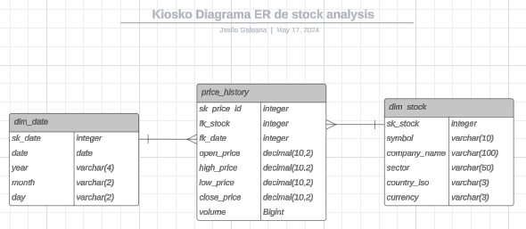
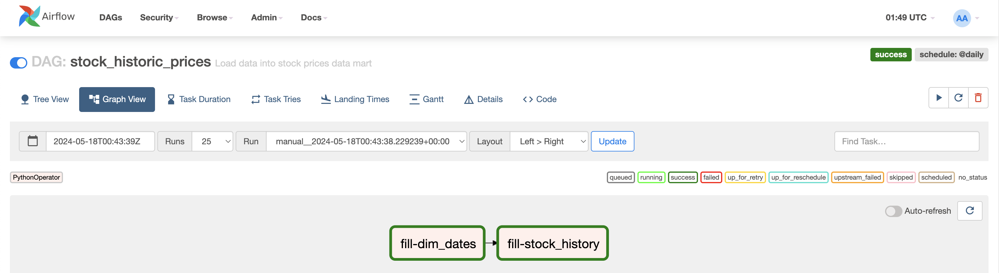

# PRUEBA TÉCNICA KIOSKO

## Diseño y Modelado de Datos



Justificación del esquema: 
Dado que tiene pocas tablas, se puede ver un esquema tipo estrella, donde tenemos en medio la fact del histórico de precios por fecha (día) y stock, como se muestra, tenemos dos tablas de dimensiones para las fechas y los stocks lo que lleva a relacionar las tablas con llaves foráneas que son las columnas sk_date y sk_stock respectivamente en las tablas de tipo dimensión.  

dim_date:  
Esta tabla contiene las fechas que podríamos utilizar en los reportes del usuario, se agregaron las columnas year, month y day para insights con temporalidad por año, mes y día.

dim_stock:
Esta tabla contiene todos los stocks que están interesados los usuarios en analizar.

fact_price_history:
En esta tabla se encuentra todo el histórico de los precios de las acciones que se tienen almacenadas, por medio de llaves foráneas se puede relacionar la data con las tablas de dimensiones.

Este modelo ayudará bastante a hacer dashboards para graficar los insights que se pueden sacar de esta información como lo pueden ser:
- Diferencia del precio de cierre entre el día actual y el anterior
- Diferencia en % del precio de cierre entre el día actual y el anterior
- Tendencias a la alza o baja de la acción
- Volatilidad diaria (mto y %)
- Entre otros.

## Desarrollo de ETL:




## Análisis de Datos y Reporting:
Para el análisis de datos podemos utilizar vistas para transformar los datos con SQL, así los usuarios podrán consultar de una manera más sencilla y sin consumir demasiados recursos la información que más se utiliza.  
  
- Volatilidad diaria
```sql
CREATE VIEW mi_kiosko.view_daily_volatility AS
with stock_price_history as(
	select dd."date", ds.symbol as stock, fph.open_price, fph.high_price, fph.low_price, fph.close_price, fph.volume 
	from mi_kiosko.fact_price_history fph 
	left join mi_kiosko.dim_date dd 
	on fph.fk_date = dd.sk_date 
	left join mi_kiosko.dim_stock ds 
	on fph.fk_stock = ds.sk_stock 
	where ds.symbol = 'AAPL'
)
SELECT 
    date,
    stock,
    high_price,
    low_price,
    (high_price - low_price) AS daily_volatility,
    1 - (low_price / high_price ) AS daily_volatility_perc
FROM 
    stock_price_history
ORDER BY 
    stock, date;
```  
  
- Cambio de precio entre el día actual y el día anterior
```sql 
CREATE VIEW mi_kiosko.view_pricing_change AS
with total_data as(
	select dd."date", ds.symbol, fph.open_price, fph.high_price, fph.low_price, fph.close_price, fph.volume 
	from mi_kiosko.fact_price_history fph 
	left join mi_kiosko.dim_date dd 
	on fph.fk_date = dd.sk_date 
	left join mi_kiosko.dim_stock ds 
	on fph.fk_stock = ds.sk_stock 
	where ds.symbol = 'AAPL'
)
SELECT 
    date,
    symbol,
    close_price,
    LAG(close_price, 1) OVER (PARTITION BY symbol ORDER BY date) AS previous_close_price,
    close_price - LAG(close_price, 1) OVER (PARTITION BY symbol ORDER BY date) AS price_change,
    1 - (LAG(close_price, 1) OVER (PARTITION BY symbol ORDER BY date) /close_price) AS percentage_change
FROM 
    total_data
ORDER BY 
    symbol, date;
```

## Optimización y Automatización
La optimización y escalabilidad de este proyecto puede incrementarse de manera exponencial, siempre considerando el volumen de datos. Las consultas SQL pueden optimizarse al máximo analizando un "query plan", e incluso sustituyendo el código SQL por código python en caso de seguir incrementando el volumen de información a procesar, cambiando algunas transformaciones para finalizar los procesamientos en agregaciones que ayuden al usuario tener insights disponibles y confiables.

Monitorización y alertas en airflow:
- Agregar un dag el cual pueda consultar todas las tablas a cargar para comprobar que los datos están al día, los montos se acercan o son exactos de acuerdo a un estimado, si el negocio lo permite tener límites inferiores y superiores, entre otros parámetros para medir la calidad de los datos y su completitud.
